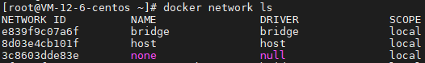

### 笔记请访问[文档](https://dockertips.readthedocs.io/en/latest/container-quickstart/container-vs-vm.html)、[github](https://github.com/xiaopeng163/docker.tips)

### 命令
- 列出容器所占用得进程
  ```
  docker top {容器id/名字}
  ```
- 显示分层
  ```
  docker history {容器id/名字}
  ```
- 清除已停止的容器
  ```
  docker system prune -f
  ```
- 删除未使用的镜像
  ```
  docker image prune -a
  ```
- -rm 执行完之后自动删除
  ```
  docker run {--rm nginx} ...
  ```
- -f 强制删除容器，少了停止容器操作
  ```
  docker run {-f} ...
  ```

### dockerfile语法说明
- FROM 拉取镜像
- RUN 所有shell能执行的命令RUN几乎都可执行，每一行RUN命令都会产生一层image layer，导致镜像臃肿，尽量一行写完。
- COPY 和 ADD 都可以把local文件复制到镜像，如果目标目录不存在，则自动创建。ADD相比COPY，在复制gzip等压缩文件时，ADD会自动解压文件。仅复制选择COPY，需自动解压选择ADD。
- WORKDIR 目录切换，类似于cd命令，若目录不存在则自行创建。
- ARG 和 ENV 在build时设置变量。ARG 可在镜像build时动态修改, 通过 --build-arg；ENV 设置的变量可以在Image中保持，并在容器中的环境变量里
  ```
  FROM ubuntu:20.04
  ARG VERSION=2.0.1
  RUN apt-get update && \
      apt-get install -y wget && \
      wget https://github.com/ipinfo/cli/releases/download/ipinfo-${VERSION}/ipinfo_${VERSION}_linux_amd64.tar.gz && \
      tar zxf ipinfo_${VERSION}_linux_amd64.tar.gz && \
      mv ipinfo_${VERSION}_linux_amd64 /usr/bin/ipinfo && \
      rm -rf ipinfo_${VERSION}_linux_amd64.tar.gz
  ```
  ```
  FROM ubuntu:20.04
  ENV VERSION=2.0.1
  RUN apt-get update && \
      apt-get install -y wget && \
      wget https://github.com/ipinfo/cli/releases/download/ipinfo-${VERSION}/ipinfo_${VERSION}_linux_amd64.tar.gz && \
      tar zxf ipinfo_${VERSION}_linux_amd64.tar.gz && \
      mv ipinfo_${VERSION}_linux_amd64 /usr/bin/ipinfo && \
      rm -rf ipinfo_${VERSION}_linux_amd64.tar.gz
  ```
  ```
  $ docker image build -f .\Dockerfile-arg -t ipinfo-arg-2.0.0 --build-arg VERSION=2.0.0 .
  $ docker image ls
  REPOSITORY         TAG       IMAGE ID       CREATED          SIZE
  ipinfo-arg-2.0.0   latest    0d9c964947e2   6 seconds ago    124MB
  $ docker container run -it ipinfo-arg-2.0.0
  root@b64285579756:/#
  root@b64285579756:/# ipinfo version
  2.0.0
  root@b64285579756:/#
  ```
- CMD 容器启动命令。如果docker container run启动容器时指定了其它命令，则CMD命令会被忽略；如果定义了多个CMD，只有最后一个会被执行；
- ENTRYPOINT 容器启动命令。与 CMD 区别，CMD 设置的命令，可以在docker container run 时传入其它命令，覆盖掉 CMD 的命令，但是 ENTRYPOINT 所设置的命令是一定会被执行的。ENTRYPOINT 和 CMD 可以联合使用，ENTRYPOINT 设置执行的命令，CMD传递参数
  ```
  FROM ubuntu:20.04
  ENTRYPOINT ["echo"]
  CMD []
  ```
  - CMD和ENTRYPOINT同时支持shell格式和Exec格式
    ```
    CMD echo "hello docker"
    ENTRYPOINT echo "hello docker"

    CMD ["echo", "hello docker"]
    ENTRYPOINT ["echo", "hello docker"]
    ```
  - 命令含有变量时shell需要指定参数
    ```
    FROM ubuntu:20.04
    ENV NAME=docker
    CMD echo "hello $NAME"

    FROM ubuntu:20.04
    ENV NAME=docker
    CMD ["sh", "-c", "echo hello $NAME"]
    ```
- EXPOSE 对外暴露端口，不设置也可以通过-p做映射，更多起到注释作用。他人使用时知道镜像可以暴露端口对外使用。
  ```
  FROM python:3.9.5-slim
  COPY app.py /src/app.py
  RUN pip install flask
  WORKDIR /src
  ENV FLASK_APP=app.py
  EXPOSE 5000
  CMD ["flask", "run", "-h", "0.0.0.0"]
  ```
- USER 指定用户
- VOLUME 将docker中的文件路径映射到数据卷。当启动容器未设置-v参数时docker自动生成数据卷。
- HEALLTHCHECK 健康检查，测试是否正常提供服务
  ```
  HEALLTHCHECK --interval=30s --timeout=3s \
    CMD curl {url} || exit 1
  ```

### dockerfile实用技巧，[可参考官方镜像编写规范](https://github.com/docker-library/official-images)
- 合理使用缓存。在build时会使用缓存，从更改的分层开始不使用缓存，可以将经常变动的操作尽量放在后面，减少构建时间。
- 使用.dockerignore忽略文件，build时 build context 将过滤忽略文件。
- 镜像的多阶段构建，减少镜像大小
  ```
  FROM gcc:9.4 AS builder
  COPY hello.c /src/hello.c
  WORKDIR /src
  RUN gcc --static -o hello hello.c

  FROM alpine:3.13.5
  COPY --from=builder /src/hello /src/hello
  ENTRYPOINT [ "/src/hello" ]
  CMD []

  # AS builder 类似于重命名
  # -- from 引入builder
  ```
- 尽量使用非root用户。避免通过docker做越权的事，比如通过目录映射查看无权访问的目录，或者给自己添加sudo权限。
  ```
  FROM python:3.9.5-slim

  RUN pip install flask && \
      groupadd -r flask && useradd -r -g flask flask && \
      mkdir /src && \
      chown -R flask:flask /src

  USER flask

  COPY app.py /src/app.py

  WORKDIR /src
  ENV FLASK_APP=app.py

  EXPOSE 5000

  CMD ["flask", "run", "-h", "0.0.0.0"]
  ```
### docker持久化
- Data Volume, 由Docker管理，(/var/lib/docker/volumes/ Linux), 持久化数据的最好方式
- Bind Mount，由用户指定存储的数据具体mount在系统什么位置

### docker网络
  - 系统命令
    - 查看端口
      ```
      # linux
      ip a、ip addr、ifconfig
      # window
      ipconfig
      # eth0 对外通信网络
      ```
    - 测试端口连通性
      ```
      telnet {www.baidu.com 80}
      ```
    - 路径探测跟踪
      ```
      # linux
      tracepath、traceroute
      ```
    - 查看路由
      ```
      ip route
      ```
    - 查看转发规则
      ```
      iptables --list -t nat
      ```
    - 查看端口转发信息
      ```
      iptables -t nat -nvxL
      ```
  - docker 命令
    - 现有容器链接多个网络
      ```
      docker network connect {网络名} {容器名}
      ```
  - docker 默认有bridge、host、node三个网络\
    
    - host 网络和宿主机网络完全相同，如果容器端口指定为host则相当于宿主机监听该端口，无法在启动相同镜像因为端口已经被占。

### Docker Compose
- 安装docker Compose
  ```
  docker install docker compose
  ```
- docker compost语法
  ```
  version: "3.8"
  services: # 容器
    servicename: # 服务名字，这个名字也是内部 bridge网络可以使用的 DNS name
      build: # 通过本地dockerfile build镜像，同时添加image参数表示设置build出来的镜像名
      image: # 镜像的名字
      command: # 可选，如果设置，则会覆盖默认镜像里的 CMD命令
      environment: # 可选，相当于 docker run里的 --env
      volumes: # 可选，相当于docker run里的 -v
      networks: # 可选，相当于 docker run里的 --network
      ports: # 可选，相当于 docker run里的 -p
      depends_on # 设置执行顺序
    servicename2:
  volumes: # 可选，相当于 docker volume create
  networks: # 可选，相当于 docker network create
  ```
- 命令
  ```
  # 启动
  docker-compose up
    - 在已经执行过docker-compose up且处于up状态时可以再次执行docker-compose up --build，会重新build已经更改过的镜像。
    - -env-file 手动指定环境变量路径
  # 查看启动列表，需要在docker-compose.yml目录执行，否则无法找到，或者添加-f指定目录
  docker-compose ps
  # 停止
  docker-compose stop
  # 构建镜像
  docker-compose build [镜像名字，表示具体build哪个，否则build全部]
  # 重启，当环境变量更改时需要通过此方法重启镜像使用新的值
  docker-compose restart
  # 查看环境变量
  docker-compose config
  ```

### docker swarm
- 退出集群 
  ```
  docker swarm leave --force
  ```
- 创建service
  ```
  docker service create {nginx:latest}
  ```
- 查看service 列表
  ```
  docker service ls
  ```
- 查看server详情
  ```
  docker service ps {service id}
  ```
- stack启动服务，类似于docker-compose，用于swarm集群，都可以使用docker-compose.yml文件

### 提示
- alpine镜像相对会小，如果需要在镜像中安装其他应用可能需要自行安装该镜像的基础服务。