### 配置[renren_fast](https://www.renren.io)sql
- 使用datagrip创建数据库\
    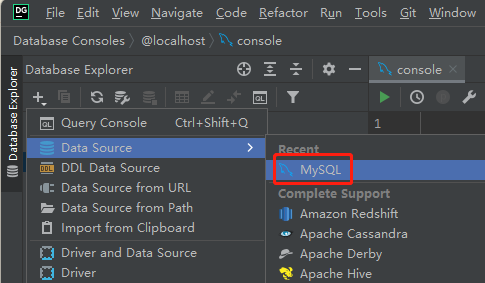\
    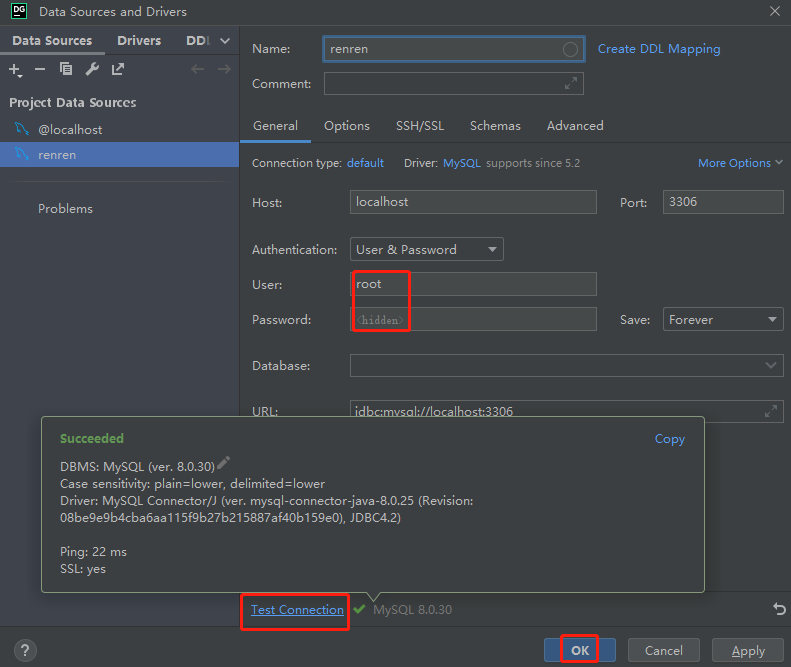
- 创建逻辑库\
    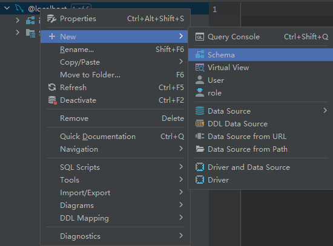\
    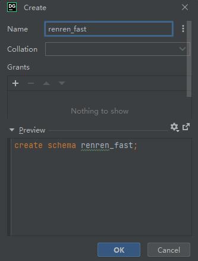
- 执行sql语句\
    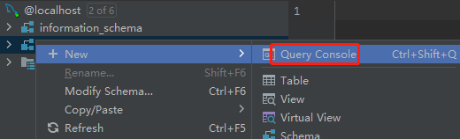\
    1. 复制[sql语句](./code/mysql.sql)全选点击 run 执行\
    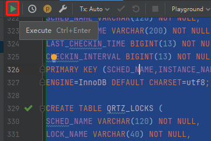

### Java环境配置省略

### 启动后台

### Linux基础知识强化
- ip address 查看IP\
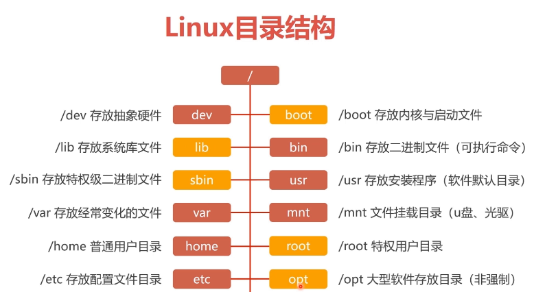
- 目录与文件管理\
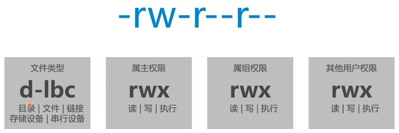
    - ls 列出当前文件或目录
    - mkdir 创建目录
    - touch 创建文件
    - echo 向文件写入内容
    - cat 显示文件内容
    - cp 复制文件
    - rm 删除文件/目录
    - mv 移动文件/目录

- 设置用户
    - adduser 添加用户. adduser {test}
    - passwd 设置用户名. passwd {test}

- CentOS7防火墙
    - CentOS7默认安装了firewalld防火墙
    - 利用防火墙，我们可以允许或是限制传输的数据通过\
        
    - 查看、启用、关闭、重启防火墙
        ```
        service firewalld start 启动防火墙
        service firewalld stop 关闭防火墙
        service firewalld restart 重启防火墙
        firewall-cmd --state 查看防火墙状态
        firewall-cmd --list-all 查看防火墙规则
        firewall-cmd --permanent --add-port=8080/tcp 添加开放端口, 也可以设置范围8080-8090
        firewall-cmd --permanent --remove-port=8080/tcp 删除开放端口, 也可以删除范围8080-8090, 删除范围与添加范围要一致
        firewall-cmd --permanent --list-ports 查询开放的端口列表
        firewall-cmd --reload 使最新的防火墙规则生效
        firewall-cmd --permanent --add-service=http 添加允许访问互联网的服务
        firewall-cmd --permanent --list-services 查看允许访问互联网的服务列表
        systemctl status firewalld.service 查看firewall服务状态
        ```
        ```
        以上命令如果提示: Failed to start firewall.service: Unit not found.则表示未安装firewall.
        需执行yum install firewalld firewall-config安装firewall
        ```
### docker
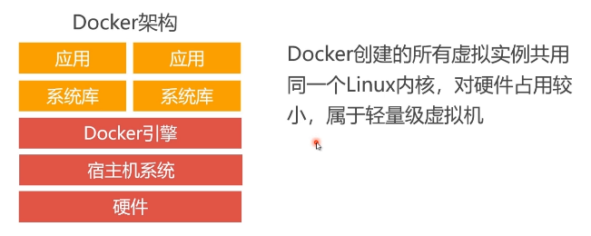
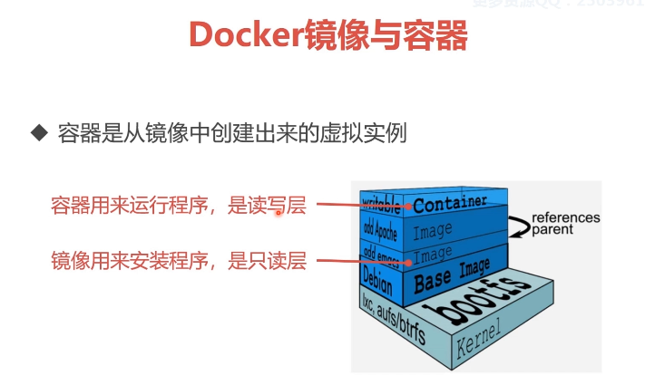
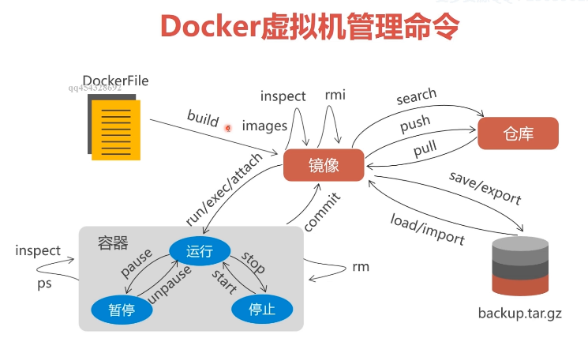

- 安装docker
    ```
    yum -y update
    yum -y install docker\
    -y 表示选择程序安装中的yes选项
    ```

- docker 操作
    ```
    service docker start
    service docker stop
    service docker restart
    ```
- 镜像操作
    ```
    docker search {java} 搜索
    docker pull {docker.io/openjdk} 安装
    docker images 查看安装的镜像
    docker save {docker.io/openjdk} > {/home/java.tar.gz} 导出镜像
    docker load < {/home/java.tar.gz} 导入镜像
    docker rmi {docker.io/openjdk} 删除镜像
    docker tag {docker.io/openjdk} {new_name} 克隆镜像
    ```
    ```
    国外镜像仓库下载速度较慢, 建议使用国内镜像仓库, 
    如: DaoClound https://www.daocloud.io/mirror
    安装完之后需要修改docker设置，删除逗号
    vim /etc/docker/daemon.json
    ```
    启动镜像创建一个运行状态的容器
    ```
    执行容器
    docker run -it [--name test_java] [-p 9000:8080 -p9001:8085] {docker.io/openjdk} bash
    docker run -it [--name test_java] [-v /home/project:/soft] [--privileged] {docker.io/openjdk} bash

    进入后台运行的容器
    docker exec -it {test_java} {bash} 
  
    -it 启动之后自动进入到docker环境中, exit 退出容器
    java 镜像名字
    bash 执行bash命令
    -p 9000:8080 -p9001:8085 把容器的8080/8085端口映射到宿主机9000/9001端口
    -v /home/project:/soft 将宿主机/home/project映射到docker /soft中
    --privileged 拥有最高权限
    ```
    暂停、停止容器
    ```
    docker pause {test_java}  暂停
    docker unpause {test_java} 从暂停恢复启动
    docker stop {test_java} 停止
    docker start -i {test_java} 启动
    docker ps -a 查看运行状态
    docker logs {test_java} 查看日志
    ```
### 数据库集群
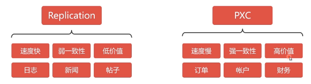

- pxc原理\
    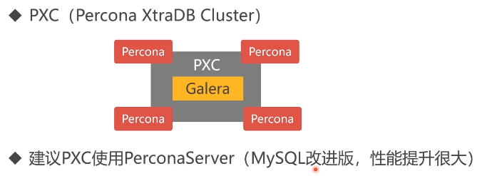
- pxc数据强一致性
    - 同步复制，事务在所有集群节点要么同时提交要么不提交。
    - Replication采用异步复制，无法保证数据的一致性。
- pxc docker镜像[地址](https://hub.docker.com/r/percona/percona-xtradb-cluster)
- 创建内部网络
    - 处于安全考虑，需要给pxc集群实例创建docker内部网络
        ```
        docker network create [--subnet=172.18.0.0/24] {pxc-network} 创建网段
        docker network inspect {pxc-network} 查看网段信息
        docker network rm {pxc-network} 删除网段
        ```
- 创建docker卷
    - docker可以将文件映射到宿主机但是pxc不能, 需要使用docker卷（容器中的pxc节点映射数据目录的解决方法）
        ````
        docker volume create {--name v1} 创建卷
        docker inspect {v1} 查看卷信息
        docker volume rm {v1} 删除卷
        docker volume ls 查看卷列表
        ````
- 创建pxc容器
    - 只需要向pxc镜像传入运行参数就能创建pxc容器
        ```
        docker run -d \
          -p 3306:3306 \
          -e XTRABACKUP_PASSWORD=123456 \
          -e MYSQL_ROOT_PASSWORD=123456 \
          -e CLUSTER_NAME=pxc-cluster \
          -v v1:/var/lib/mysql \
          --name=pxc-node1 \
          --net=pxc-network \
          --privileged \
          --ip 172.18.0.2 \
          pxc

        -d 创建出的容器在后台运行
        -p 前面是宿主机端口，后面是容器端口，多个节点端口相同但宿主机端口不能相同
        -e MYSQL_ROOT_PASSWORD 数据库实例密码，用户名默认为root
        -e CLUSTER_NAME 集群名字
        -e XTRABACKUP_PASSWORD数据库节点之间同步密码
        -e CLUSTER_JOIN 需要与某个集群同步，主节点不需要此参数-e CLUSTER_JOIN=node1
        -v 路径映射，v1卷映射到docker的mysql中，mysql路径为/var/lib/mysql
        --name 创建出来的容器名字
        --net 容器分到的内部网段
        --privileged 最高权限
        --ip 容器分到的ip地址
        pxc 镜像名字
        ```
    - 提示
        - 如果创建失败，有可能是firewalld和docker开启顺序有误，需要先启动firewalld然后在启动docker不然会抛[类似错误](https://blog.csdn.net/a1010256340/article/details/79986959)
        - 如果是在云服务环境中操作，创建之后无法链接则需要添加防火墙策略
        - 如果添加-p参数需要在创建网络时添加subnet ```docker network create [--subnet=172.18.0.0/24] {pxc-network}```否则会报address不存在

    - 进入节点，建议至少创建3个节点否则可能会出现问题\
        docker exec -it {pxc-node1} /usr/bin/mysql -uroot -p123456

    - 创建从节点
      - ```注意```:
        - 创建从节点之前需要先创建docker卷，复制主节点所映射的docker卷里面的.pem文件，然后更改文件权限。比如主节点docker卷是v1，从节点是v2
          - 复制主节点.pem文件 
            ```
            cp /var/lib/docker/volumes/v1/_data/*pem /var/lib/docker/volumes/v2/_data
            ```
          - 文件赋予权限
            ```
            chown 1001:1001 /var/lib/docker/volumes/v2/_data/*.pem
            ```

        - 创建命令
          ```
          docker run -d \
            -p 3307:3306 \
            -e XTRABACKUP_PASSWORD=123456 \
            -e MYSQL_ROOT_PASSWORD=123456 \
            -e CLUSTER_NAME=pxc-cluster \
            -e CLUSTER_JOIN=pxc-node1 \
            -v v2:/var/lib/mysql \
            --name=pxc-node2 \
            --net=pxc-network \
            --privileged \
            --ip 172.18.0.3 \
            pxc
          ```

    - 删除节点
        docker rm {node1}
### 数据库负载均衡
- 使用Haproxy做负载均衡，请求被均匀分发给每个节点，单节点负载低性能好
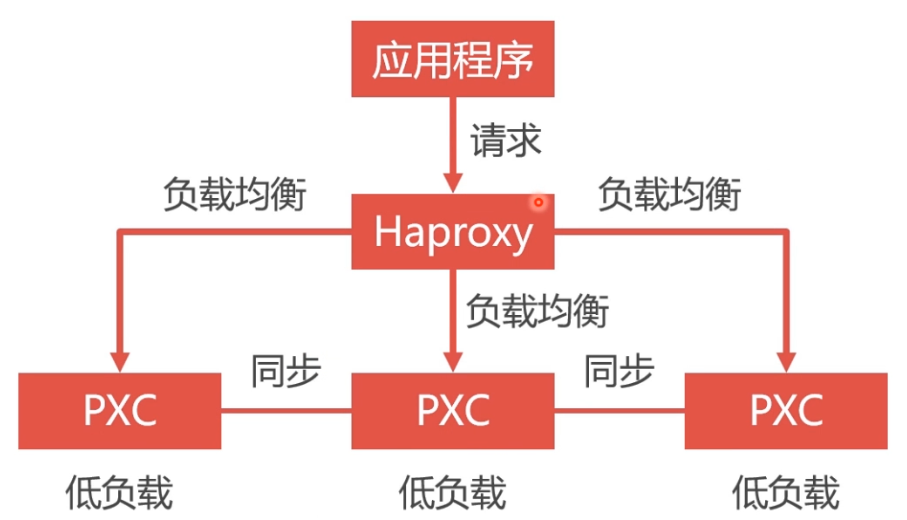
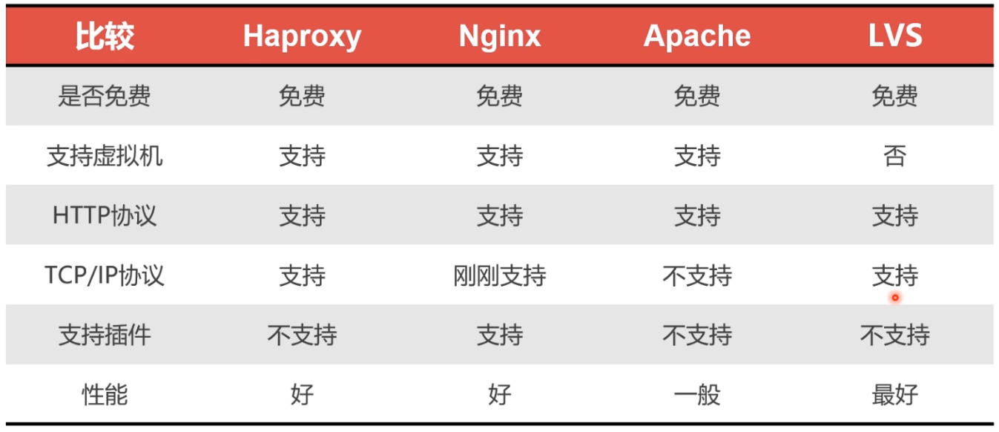
- 安装Haproxy镜像```docker pull haproxy```
    - 创建Haproxy配置文件```touch /home/soft/haproxy.cfg```[配置详情](./code/haproxy.cfg)
- 创建Haproxy容器\
在创建之前需要先将[配置文件](./code/haproxy.cfg)放到宿主机中。创建目录```mkdir /home/soft/haproxy -p```上传文件
    ```
    docker run -it -d \
      -p 4001:8888 \
      -p 4002:3306 \
      -v /home/soft/haproxy:/usr/local/etc/haproxy \
      --name haproxy1 \
      --privileged \
      --net=pxc-network \
      haproxy \
      bash

    -p 4002:3306 haproxy对外提供3306负载均衡端口，3306已被宿主机占用于是映射到4002端口
    -p 4001:8888 haproxy提供一个后台监控画面在配置文件中被定义为8888，映射到4001端口
    --name 建议叫h1，后面会配置多节点
    --net 和pxc处于同一网段
    ```
- 进入容器加载配置文件\
  ```
  docker exec -u 0 -it {haproxy1} {bash}
  haproxy -f /usr/local/etc/haproxy/haproxy.cfg
  ```
  ```
  可以通过多次-f实现haproxy多配置文件方案
  -u 0 表示root用户不然会有权限问题
  ```
  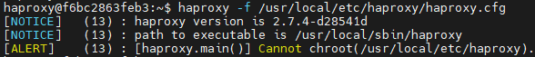
- 在pxc集群中的mysql数据库中创建haproxy用户名```CREATE USER 'haproxy'@'%' IDENTIFIED BY '';```
  - % 表示任何账号都可登陆
  - BY '' 密码为空
- 通过浏览器访问后台，ip为宿主机对外ip，端口、路径、账号密码都写在配置文件中。比如http://175.178.234.238:4001/dbs
  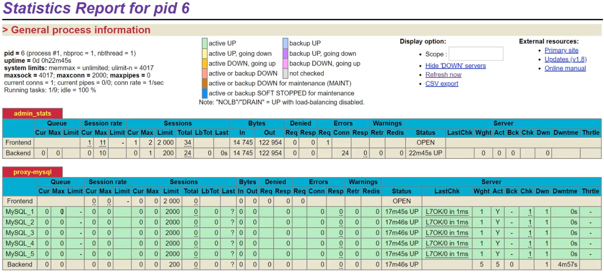
- 通过数据库可视化软件链接至Haproxy数据库，对其进行增删改查也会影响到真实数据库。Haproxy数据库本身不存储任何内容，只是将请求均匀转发到真实数据库做处理，达到负载均衡效果。

### 双机热备
- 单节点Haproxy不具备高可用，必须要有冗余设计\
    
- 双击热备依赖于虚拟IP\
    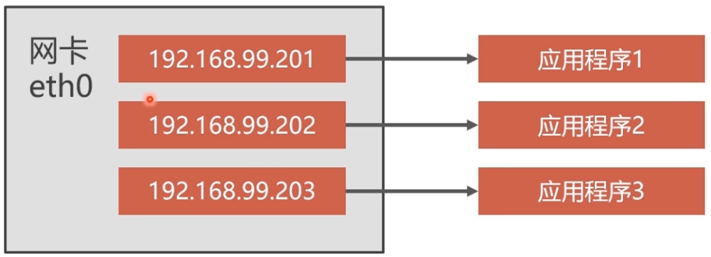
- 利用Keepalived实现双机热备\
    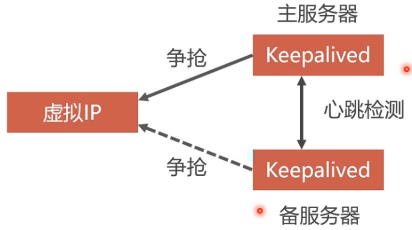
- 双机热备架构集群.
    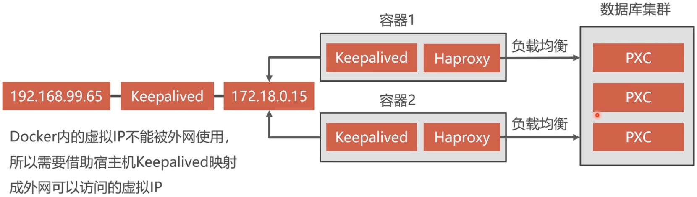
- 安装Keepalived\
Keepalived必须安装在Haproxy所在容器之内
    ```
    apt-get update
    apt-get install keepalived
    ```
    ```
    因为Haproxy是通过Ubuntu创建出来，所以使用apt-get而不是yum
    建议通过apt-get加速方案安装，否则会很慢。
    ```
    ```
    cp /etc/apt/sources.list \
      /etc/apt/sources.list.bak \
      && sed -i "s@http://deb.debian.org@http://mirrors.aliyun.com@g" \
      /etc/apt/sources.list \
      && rm -rf /var/lib/apt/lists/* \
      && apt-get update
    ```
- Keepalived配置文件\
Keepalived配置文件是/etc/keepalived/keepalived.conf
  ```
  如果在终端内编写配置文件需要安装vim
  apt-get install vim
  vim /etc/keepalived/keepalived.conf
  ```
- 启动Keepalived，宿主机可ping通虚拟IP ping 172.18.0.201
  ```
  service keepalived start
  ```
- 冷备份
  - 冷备份是关闭数据库时候的备份方式，通常做法是拷贝数据文件
  - 冷备份是最简单最安全的一种备份方式
  - 大型网站无法做到关闭业务备份数据，所以冷备份不是最佳选择。但可以通过下线集群中的一个数据库备份数据，来达到不停服备份\
  
- 热备份
  - 热备份是在系统运行的状态下备份数据，也是难度最大的备份
  - MySQL常见的热备份有LVM和XtraBackup两种方案
  - 建议使用XtraBackup备份MySQL
- XtraBackup介绍\
XtraBackup是一款基于InnoDB的在线热备工具，具有开源免费，支持在线热备，占用磁盘空间小，能够非常快速地备份与恢复MySQL数据库。
  - 优势
    - XtraBackup备份过程不锁表、快速可靠
    - XtraBackup备份过程不会打断正在执行的事务
    - XtraBackup能够基于压缩等功能节约磁盘空间和流量
  - 全量备份和增量备份
    - 全量备份是备份全部数据。备份过程时间长，占用空间大
    - 增量备份是只备份变化的那部分数据。备份时间段，占用空间小
- 安装之前的准备工作\
因为备份的数据在数据库所在的容器之内，当容器重启时数据会丢失。应该把备份的数据保存在宿主机上，通过docker卷映射。在宿主机上创建数据卷将其映射到某个节点上进行备份。
  - 创建数据卷 ```docker volume create {backup}```
  - 删除原有node1数据库重新创建
    ```shell
    docker run -d \
        -p 3306:3306 \
        -e XTRABACKUP_PASSWORD=123456 \
        -e MYSQL_ROOT_PASSWORD=123456 \
        -e CLUSTER_NAME=pxc-cluster \
        -e CLUSTER_JOIN=pxc-node2 \
        -v v1:/var/lib/mysql \
        -v backup:/data \
        --name=pxc-node1 \
        --net=pxc-network \
        --privileged \
        --ip 172.18.0.2 \
        pxc
    ```
  - XtraBackup安装在PXC容器中
    - 全量热备份
      ```shell
      #进入node1容器
      docker exec -it -u 0 {node1} bash
      #更新软件包
      apt-get update
      #安装热备工具
      apt-get install percona-xtrabackup-24
      #全量热备
      innobackupex --user=root --password=123456 /data/backup/full
      ```
    - 全量冷还原
      - 数据库可以热备份，但是不能热还原。为了避免恢复过程中的数据同步，我们采用空白的MySQL还原数据，然后在建立PXC集群
      - 还原数据前要将未提交的事务回滚，还原数据之后重启MySQL
        ```shell
        #删除数据
        rm -rf /var/lib/mysql/*
        #清空事务
        innobackupex --user=root --password=123456 --apply-back /data/backup/full/2018-04-15_05-09-07/
        #还原数据
        innobackupex --user=root --password=123456 --copy-back  /data/backup/full/2018-04-15_05-09-07/
        ```
        ```shell
        还原流程：
        #停止所有节点
        docker stop node1 node2...
        #删除所有节点
        docker rm node1 node2...
        #删除所有数据卷
        docker volume rm v1 v2...
        #创建数据卷
        docker volume create v1
        #创建pxc容器
        docker run -d \
          -p 3306:3306 \
          -e XTRABACKUP_PASSWORD=123456 \
          -e MYSQL_ROOT_PASSWORD=123456 \
          -e CLUSTER_NAME=pxc-cluster \
          -v v1:/var/lib/mysql \
          --name=pxc-node1 \
          --net=pxc-network \
          --privileged \
          --ip 172.18.0.2 \
          pxc
        #进入容器
        docker exec -it {node1} bash
        #删除数据
        rm -rf /var/lib/mysql/*
        #清空没有回滚的事务
        innobackupex --user=root --password=123456 --apply-back /data/backup/full/2018-04-15_05-09-07/
        #还原数据
        innobackupex --user=root --password=123456 --copy-back  /data/backup/full/2018-04-15_05-09-07/
        #停止容器
        docker stop {node1}
        #重启容器
        docker start {node1}
        ```
    - 增量备份与恢复请看pxc集群的其他视频