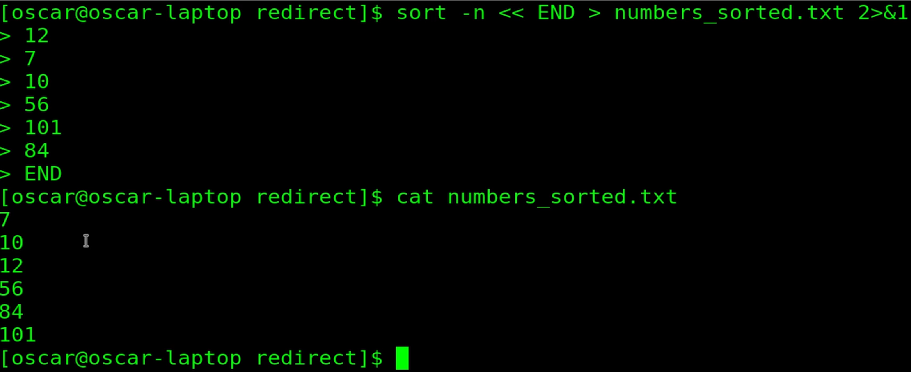
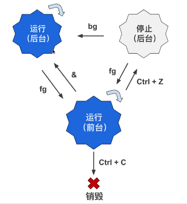
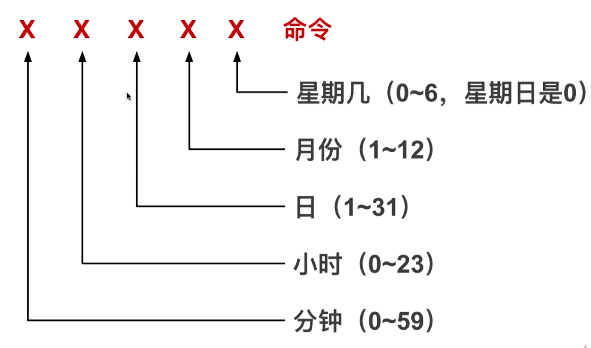
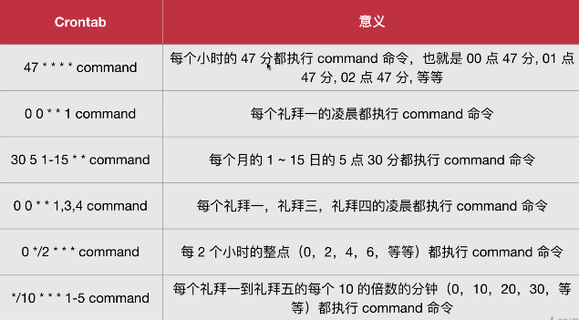

#### 主流桌面管理器

- Gnome、KDE、XFCE

#### 命令行每行都会有的前缀意思

    [waldron@host220 ~]$

- waldron 当前用的名字(username)。Linux 是多用户的操作系统
- @ 前面是用户名，后面是所在的域。例如 xxx.gmail.com
- host220 电脑/主机的名字。也就是主机名(hostname)
- ~ 当前所在目录的名字，会随着用户进入不同目录而改变
  - ~ 表示当前用户的用户目录(home directory)
- $ 指示所具有的权限
  - $ 表示普通用户，有权限的限制
- \# 表示超级用户，也就是 root(英语“根”的意思)
  - root 拥有所有权限

#### 常见命令

- sudo su 切换用户
- 退出 root 身份回到普通用户 ctrl + d 或 exit 命令
- whoami 查看当前用户
- hostname 查看主机名称

  #### date

  - date 是“日期”的意思，用于显示当前时间
  - CST 是 Central Standard Time 的缩写，表示“中央标准时间”

  ### ls

  - 查看当前目录的文件或文件夹
  - ls 是 list 的缩写。list 是“列举”，“列出”的意思

##### 命令参数

- 短参数通常用空格隔开，eg: command -p 10
- 长参数通常用等号隔开，eg: command --parameter=10
- 多个短参数可以连写，多个长参数只能用空格隔开

##### 命令的历史记录

- 向上键：按时间顺序向前查询用过的命令，每按一次就前进一个命令
- 向下键：按时间顺序向后查询用过的命令，每按一次就前进一个命令
- ctrl + r：用于查询使用过的命令
- history：列出之前用过的所有命令，使用`!编号`重新运行该条命令

#### 快捷键

- Tab 补全命令、路径等
- Ctrl + L 用于清理终端内容，同 clear 命令
- Ctrl + D 给终端传递 EOF（End Of File，文件结束符），关闭终端
- Shift + PgUp 用于向上滚屏，与鼠标的滚轮向上滚屏是一个效果
- Ctrl + A 光标跳到一行命令的开头，按 Home 一样
- Ctrl + E 光标跳到一行命令的结尾，按 End 一样
- Ctrl + U 删除所有在光标左侧的命令字符
- Ctrl + K 删除所有在光标右侧的命令字符
- Ctrl + W 删除光标左侧的一个“单词”，“单词”指用空格隔开的一个字符串。例如-a 就是一个“单词”
- Ctrl + Y 粘贴用 Ctrl+U、Ctrl+K、Ctrl+W 删除的字符串，有点像 剪切-粘贴

#### Linux 的目录组织，[参考地址](https://linuxtoy.org/archives/linux-file-structure.html)

- bin: 包含所有用户使用的可执行程序。英语 binary 的缩写，表示“二进制文件”
- boot：包含与 Linux 启动密切相关的文件。英语 boot 表示“启动”
- dev：英语 device 的缩写，表示“设备”，它里面的子目录每一个对应一个外设。比如代表我们的光盘启动器的文件就会出现在这个目录下面
- etc：包含系统配置文件。法语 et cetea 的缩写，翻译英语就是 and so on，表示“...等等”
- home：每个用户都在 home 目录下有个和用户名一个的目录，除了 root 用户
- lib：包含被程序所调用的库文件。英语 library 的缩写，表示“库”，例如.so 结尾的文件，Windows 下这样的库文件是以.dll 结尾。
- media：可移动的外设（USB 盘、SD 卡、DVD、光盘...）。英语 media 表示“媒体”，插入电脑时 Linux 可以让我们通过 media 子目录来访问这些外设中的内容。
- mnt：有点类似 media 目录，但一般用于临时挂载一些装置。英语 mount 的缩写，表示“挂载”
- opt：用于安装多数第三方软件和插件。英语 optional application software package 的缩写，表示“可选的应用软件包”
- root：超级用户 root 的用户目录。英语“跟”的意思，一般用户在 home 下面
- sbin：包含系统级的重要可执行程序。英语 system binary 的缩写，表示“系统二进制文件”，比 bin 目录多了一个前缀 system（系统）
- srv：包含一些网络服务启动之后所需要取用的数据。英语 service 的缩写，表示“服务”
- tmp：普通用户和程序存放临时文件的地方。英语 temporary 的缩写，表示“临时的”
- usr 安装了大部分用户要调用的程序。类似于 window 中的 C:\Windows 与 C:\Program Files 目录的集合，是最庞大的目录之一。表示“Unix 操作系统软件资源”（类似 etc，也是历史遗留命名）。是英语 Unix Software Resource 的缩写
- var：通常包括程序的数据，比如 log 文件，英语 variable 的缩写，表示“动态的，可变的”
- ...

#### 文件相关命令

- pwd 用于显示当前所在目录
- which 用于获取命令的可执行文件的位置
- ls 列出文件和目录
  - -a 查看隐藏文件
  - -l 查看详细列表
  - -t 文件最后修改的时间
  - -i 查看文件 inode，用于判断文件是否链接
- cd 切换目录
  - 相对路径：相对于当前目录
  - 绝对路径：相对于根目录
- du 显示目录包含的文件大小，深入遍历每个目录的子目录，统计所有文件的大小。相对 ls -l 命令，du 命令统计的才是真正的文件大小
  - -h 以 K、M、G 的形式显示文件大小
  - -a 显示文件和目录的大小
  - -s 只显示文件和目录总大小
- cat 一次性显示文件的所有内容。是 concatenate 的缩写，表示“链接/串联”，后跟文件名路径可以同时输出多个文件空格分割
  - -n 显示行数
- less 分页显示文件内容。和 cat 最大区别是分页显示
  - 空格键：翻页，与键盘上的 PageDown 效果一样
  - b 键：后退一页，与 PageUp 效果一样
  - 回车键：前进一行，与方向下键效果一样
  - y 键：后退一行，与方向上键效果一样
  - d 键：前进半页（半个屏幕）
  - u 键：后退半页（半个屏幕）
  - q 键：停止读取文件，中止 less 命令
  - = 键：显示处于当前文件位置
  - h 显示帮助文档
  - / 搜索模式，支持正则匹配
  - n 跳转至下一个符合搜索条件的地方，shift n 跳转至上一个
- more 和 less 类型，没有 less 强大。比如不能向后翻页，只能往前
- head 显示文件开头几行，默认显示前 10 行
  - -n 显示行数
- tail 显示文件结尾几行，默认显示后 10 行
  - -f 实时显示追踪文件的更新，默认每秒检查文件是否更新显示在界面上。
  - -s 指定间隔检查秒数
- touch 创建空白文件
- mkdir 创建目录
  - -p 递归创建目录结构
- cp 拷贝文件/目录，类似复制粘贴
  - -r 或-R 递归拷贝
- mv 移动文件/目录，类似剪切粘贴
- rm 删除文件/目录
  `如果先进入根目录执行 rm -rf / 则没有保护机制`
  - -i 向用户确认是否删除
  - -f 强制删除。终端不会询问用户是否确定删除文件
  - -r 递归删除
- rmdir 只删除空目录
- ln 创建链接，默认创建硬链接。软链接可以指向目录，硬链接不行
  - Physica link: 物理连接或硬链接
    ```
    [root@DESKTOP-AB12B3F test]# ls -l
    total 0
    -rw-r--r-- 2 root root 0 Sep 12 16:02 file1
    -rw-r--r-- 2 root root 0 Sep 12 16:02 file2
    ```
    - 都指向同一个文件内容，inode 一样。
    - 删除其中一个并不会删除指向的文件内容，只有全部删除才会删除文件内容。
    - 2 表示有两个文件拥有相同的 inode。
  - Symbolic link：符号链接或软连接
    - -s 创建软连接，类似 Windows 快捷方式
    - file2 文件内容指向 file1 文件名，如果删除 file1，file2 则成为死链接。
    - lrwxrwxrwx 首字母 l 表示软链接，硬链接和普通文件类似。
    - 1 表示拥有相同 inode 号的文件数。
    ```
    [root@DESKTOP-AB12B3F test]# ls -l
    total 0
    -rw-r--r-- 1 root root 0 Sep 12 16:17 file1
    lrwxrwxrwx 1 root root 5 Sep 12 16:17 file2 -> file1
    ```

### 用户与权限

- sudo 以 root 身份运行命令
- su 切换用户身份
- su - 切换用户身份并自动到用户文件夹下
- useradd 添加新用户
- passwd 修改/设置密码
- userdel 删除用户
  - -r 或--remove 删除用户的时候连通删除用户文件夹

### 群组管理与权限管理

- groupadd 创建群组
- usermod 修改用户账户
  - -l 对用户重命名。/home 中的用户文件夹名不会改变，需要手动修改
  - -g 修改用户所在群组
  - -G 将用户添加到多个群组，用逗号分割没有空格
    - 使用 -G 会把用户从原先的群组中删除，加入到新群组
    - -a 在不改变原来群组的基础上加入到新群组 `usermod -aG root waldron`
- groups 查询用户属于那个群组
- groupdel 删除群组
- chown 改变文件的所有者 `chown username filename`
  - `chown username:groupname filename` 改变文件群组
  - -R 递归操作
- chgrp 改变文件的群组 `chown username dirname`

### 文件权限

- drwxrwxrwx

  - d 属性
  - rwx 所有者对此文件的访问权限
  - rwx 群组用户此文件的访问权限
  - rwx 其他用户此文件的访问权限
    - 如果在相应位置有字母，表示有相应权限。短横-，表示没有相应权限
    - d 目录（属性），英语 directory 缩写
    - l 链接（属性），英语 link 缩写
    - \- 普通文件（属性）
    - r 读，英语 read 缩写
    - w 写/修改/删除，英语 write 缩写
    - x 执行/运行，英语 execute 缩写。如果 x 权限在目录上，表示目录可读。

- chmod 修改访问权限

  - 不需要 root 用户才能运行，只要是此文件所有者就可以用 chmod 来修改文件的访问权限
  - -R 递归修改文件访问权限
  - 用数字来分配权限：chmod 的绝对用法
    | 权限 | 数字 |
    | :-: | :-: |
    | r | 4 |
    | w | 2 |
    | x | 1 |

    | 权限 | 数字 | 计算  |
    | :--: | :--: | :---: |
    | ---  |  0   | 0+0+0 |
    | r--  |  4   | 4+0+0 |
    | -w-  |  2   | 0+2+0 |
    | --x  |  1   | 0+0+0 |
    | rw-  |  6   | 4+0+0 |
    | -wx  |  3   | 0+2+0 |
    | r-x  |  5   | 0+0+0 |
    | rwx  |  7   | 4+0+0 |

  - 用字母来分配权限：chmod 的相对用法

    - u: 所有者，user 缩写
    - g: 群组用户， group 缩写
    - o: 其他用户，other 缩写
    - a: 所有用户，all 缩写

  - 和字母配合使用的符号
    - +：添加权限
    - -：去除权限
    - =：分配权限
    ```
    chmod u+rx filename 文件file的所有者添加读和运行权限
    chmod u+r filename 文件file群组其他用户增加读权限
    chmod o-r filename 文件file的其他用户移除读权限
    chmod g+r o-r filename 文件file的群组其他用户增加读权限，其他用户移除读权限
    chmod go-r filename 文件file的群组其他用户和其他用户均移除读的权限
    chmod +x filename 文件file的所有用户增加运行权限
    chmod u=rwx,g=r,o=- filename 文件file所有者分配读、写、执行权限
    ```

### 文本编辑器

- Linux 终端文本剪辑器 Nano、Vim、Emacs
  - Nano 参数
    - -m 激活鼠标
    - -i 激活自动缩进功能
    - -A 激活 home 键功能，通常按 home 键光标会自动跳到一行的最开始，智能判断会识别缩进
  - Nano 配置 .nanorc
    - set mouse 激活鼠标
    - set autoindent: 激活缩进
    - set smarthome：激活智能 home 键
  - 可以在每个用户下配置 Nano，也可以全局配置。全局配置在/etc/nanorc 下只能被 root 权限修改

### 软件安装

- yum
  - [源列表](https://www.centos.org/download/mirrors/)
  - /etc/yum.repos.d/CentOS-Base.repo 配置软件仓库地址 [修改方法](https://blog.csdn.net/inslow/article/details/54177191)
  - 命令
    - yum update/upgrade 更新软件包，update 不删除旧包，upgrade 删除旧包
    - yum search 搜索包
    - yum install 安装
    - yum localinstall \*.rpm 安装本地 rpm 文件包
    - yum remove/autoremove 卸载
    - rpm -i \*.rpm 安装本地 rpm 文件包
    - rpm -e 包名 卸载使用 rpm 方式安装的软件包

### RTFM 阅读手册

```
  cp [OPTION]... [-T] SOURCE DEST
  cp [OPTION]... SOURCE... DIRECTORY
  cp [OPTION]... -t DIRECTORY SOURCE...

```

- 安装手册 `yum install -y man-pages`
- 更新手册文档 `mandb`
- 使用方法
  - 输入 man + 数字 + 命令/函数，可以查到相关命令和函数，若不加数字，man 默认从数字较小的手册中寻找相关命令和函数
  - man -k 通过关键词搜索命令 eg：`man -k copy`搜索与复制相关命令
- 快捷键与 less 一致
- SYNOPSIS 区域语法总结

  - 粗体：原封不动输入
  - 下划线部分：用实际内容替换（有些参数例外，比如-t，原封不动输入）
  - \[-hvc\]: []表示 hvc 可选，非强制
  - a|b：a、b 选一，不能同时输入
  - option...：省略号表示前面的内容可以输入任意多个

- apropos 查找命令与 man -k 一样

  - eg：查询使用终端控制音量 apropos sound

- 替代命令
  - -h、--help，没有 man 命令显示详细
  - whatis，相当于 man 命令精简版，只列出 man 命令显示手册的开头部门，就是概述命令的作用

### 查找文件

- locate 快速查找，搜索包含关键字的所有文件和目录

  - 缺点：新建不久的文件不会被查询到，因为还没有收录进文件数据库。Linux 一般每天更新文件数据库，因此间隔 24 小时及以上就能查询到创建的文件。也可以 updatedb 强制更新文件数据库，只能使用 root 用户执行
  - 优点：不会实际查询硬盘，而是在文件数据库中查找记录所以很快。

- find 查找文件利器，允许对找到的文件做后续操作

  - -size 文件大小查询，大于用 +、 小于用 -、没有表示等于
    - 查找大于 10M `find /var -size +10M`
    - 查询小于 10k `find /var -size -10k`
  - -name 文件名查询 `find /var -name '*.log'`
  - -atime 最近访问时间查询 `find -name "-*.txt" -atime -7`
  - -type 文件类型查询 `find -type d`
  - -delete 删除查询到的文件 `find -name ".jpg" -delete`
  - -exec 执行查询到的文件 `find on -name "*.txt" -exec chmod 600 {} \;`，将查询到的所有.txt 文件的权限改为 600，{} 用查询到的每个文件做替代 \\; 固定写法
  - -ok 与 -exec 功能一致，只是会对操作做确认提示。

- 两者区别，find 不会在文件数据库中查找文件记录，而是遍历硬盘。

### 数据操作

- grep 筛选数据
  - -I 排除二进制文件
  - -i 忽略大小写，默认区分大小写
  - -n 显示行号
  - -v 倒置，只显示搜索的文本不在的行
  - -r 递归，在所有子目录和子文件中查找 ，`grep -r "Hello World" folder/`在 folder 目录的所有子目录和子文件中查询 Hello World 字符
  - -E 正则表达式 `grep -E ^path /etc/profile`
- rgrep 等同 grep -r
- egrep 等同 grep -E
- sort 对文件行进行排序 `sort name.txt`
  - -o 将排序后的内容写入新文件
  - -r 排序倒置
  - -R 随机排序
  - -n 对数字排序，默认会当成字符串按照 1-9 排序。
- wc 文件的统计，用来统计行数、字符数、字节数等 `wc name.txt`
  - `9 9 30 name.txt` 第一个是行数，第二个是单词数，第三个是字节数，最后一个是文件名
  - -l 统计行数 `wc -l name.txt`
  - -w 统计单词数（用空格隔开的字符串）`wc -w name.txt`
  - -m 统计字符数
- uniq 删除文件中的重复内容，只能将连续的重复行变为一行
  - -c 统计重复行数
  - -d 只显示重复行的值
- cut 剪切文件的一部分内容，对文件的每一行进行剪切处理
  - -c 根据字符数来剪切 `cut -c 2-4 name.txt`
  - -d 分隔符，指定用什么分割（逗号、分号、双引号等）
  - -f 区域，剪切分隔符的那些区域

### 流、管道、重定向

输出

- \> 和 >> 重定向到文件 `ls >> test.txt`
  - \> 重定向到文件，覆盖文件
  - \>> 重定向到文件末尾，追加文件
  - /dev/null 黑洞文件 `ls >> /dev/null`，是一个文件不是目录，此文件具有唯一属性总是空，发送到/dev/null 的任何数据作废
- stdin 标准输入，文件描述符 0
- stdout 标准输出（不包括错误信息），文件描述符 1
- stderr 标准错误输出，文件描述符 2
- 2> 将标准错误输出重定向到指定文件覆盖文件
- 2>> 将标准错误输出重定向到指定文件追加到文件尾部
- 2>&1 将标准错误输出重定向到与标准输出相同的地方

  ```
  cat test.csv > results.txt 2> errors.log 将标准输出和标准错误输出分别写入到不同文件。
  如果test.cat存在则将文件内容写入到results.txt文件；否则，将错误信息写入errors.log文件
  ```

  ```
  cat test.csv > results.txt 2>&1 将标准错误输出和标准输出统一输出到results.txt覆盖原文件
  cat test.csv >> results.txt 2>&1将标准错误输出和标准输出统一输出到results.txt追加到原文件后面
  ```

输入

- < 将命令的输入重定向为文件内容
- << 将命令的输入重定向为键盘的输入。已逐行输入的模式（回车键换行），所有输入的行都将在输入结束字符串之后发送给命令。结束符可以为任意字符不一定为 END 只是约定俗成。
  ```
  sort -n << END
  ```
- 将键盘输入的内容存入到文件  
   

管道

- | 将前一个命令的输出作为后一个命令的输入

  `grep log -Ir /var/log | cut -d : -f 1 | sort | uniq`

  ```
  sudo grep log -Ir /var/log
  遍历 /var/log 目录及子目录；列出所有包含 log 关键词的行；-I 排除二级制文件，-r 递归遍历
  ```

  ```
  cut -d : -f 1
  从sudo grep log -Ir /var/log的输出结果中剪切出文件名那一列（由冒号分割的第一个区域）
  ```

  ```
  sort 排序 uniq去重
  ```

### 进程和系统监测

- Linux 多任务多用户操作系统
  - Linux 可以管理多个同时运行的程序，是多任务系统
  - Linux 也是一个多用户的系统
  - 多个用户可以同时在不同地方通过网络链接到同一个 Linux 系统
- 多用户多任务的隐患
  - 可能某个用户或者某个任务(其实就是运行着的程序)
  - 在某时让 Linux 系统过载
- w 命令都有谁在做什么

  - 查看系统中正在登录的用户

  ```
  [root@VM-12-6-centos ~]# w
  15:38:33 up 39 days,  1:42,  2 users,  load average: 0.06, 0.05, 0.05
  USER     TTY      FROM             LOGIN@   IDLE   JCPU   PCPU WHAT
  root     pts/0    113.89.32.127    10:34   41.00s  0.07s  0.05s -bash
  root     pts/1    113.89.32.127    15:38    1.00s  0.02s  0.00s w
  ```

  ```
  - 11:02:33 up 38 days, 21:06, 1 user, load average: 0.00, 0.01, 0.05
    - 11:02:33 系统执行命令的时间
    - up 系统持续运行的时间，关机或重启时间会清零
    - user 同时在线的用户数
    - load average 负载平均值，分别表示 1、5、15 分钟之内的平均负载

  - USER TTY FROM LOGIN@ IDLE JCPU PCPU WHAT
    - USER 登录用户
    - TTY 登录的终端名称
    - FROM 用户连接到的服务器 IP 地址（或者主机名）
    - LOGIN@ 用户连接系统的时间
    - IDLE 用户多久没活跃（没运行任何命令）
    - JCPU 该终端所有相关的进程使用的 CPU 时间。每当进程结束就停止计时，开始新的进程则会重新计时
    - PCPU CPU 执行当前程序所消耗的时间，当前进程表示 WHAT 列里显示的程序
    - WHAT 当下用户正运行的程序
  ```

- tload 绘制随时间变化的曲线图
- who 正在登录的用户列表
  ```
  [root@VM-12-6-centos ~]# who
  root     pts/0        2022-10-10 10:34 (113.89.32.127)
  root     pts/1        2022-10-10 15:38 (113.89.32.127)
  ```
  <!--
  - ps、top 列出运行的进程。
    - 进程就是加载到内存中运行的程序，大多数程序运行时都只在内存中启动一个进程
    -->
- ps 显示当前系统中的进程
  - 是 Process Status 的缩写，进程的静态列表
  - 显示的进程列表不会随时间而更新，是静态的，只是运行 ps 命令当时的状态，是进程的快照
    ```
    [root@VM-12-6-centos ~]# ps
      PID TTY          TIME CMD
    12797 pts/1    00:00:00 bash
    19697 pts/1    00:00:00 ps
    ```
    - PID 进程号
    - TTY 登录的终端名称
    - TIME 进程运行了多久
    - CMD 产生进程的程序名
  - -ef 列出所有用户在所有终端的所有进程
    ```
    UID        PID  PPID  C STIME TTY          TIME CMD
    root         2     0  0 Sep01 ?        00:00:02 [kthreadd]
    root         4     2  0 Sep01 ?        00:00:00 [kworker/0:0H]
    root         6     2  0 Sep01 ?        00:00:52 [ksoftirqd/0]
    ```
    - UID 运行进程的用户。user identifier 的缩写
    - PPID 程序的父进程号。parent process ID
    - ps -ef | less 分页显示
    - efH 按照乔木状列出进程
    - -u username 列出此用户运行的进程
    - -aux 通过 CPU 和内存是用来过滤进程
      ```
      [root@VM-12-6-centos ~]# ps -aux
      USER       PID %CPU %MEM    VSZ   RSS TTY      STAT START   TIME COMMAND
      root         2  0.0  0.0      0     0 ?        S    Sep01   0:02 [kthreadd]
      root         4  0.0  0.0      0     0 ?        S<   Sep01   0:00 [kworker/0:0H]
      root         6  0.0  0.0      0     0 ?        S    Sep01   0:53 [ksoftirqd/0]
      root         7  0.0  0.0      0     0 ?        S    Sep01   0:12 [migration/0]
      ```
      - %CPU 处理器占用百分比
      - %MEM 内存占用百分比
      - STAT 进程状态
      - START 启动时间
      - COMMAND 进程名字
      - ps -aux --sort -pcpu | less 根据 CPU 使用率来降序排列
      - ps -aux --sort -pmem | less 根据 内存 使用率来降序排列
      - ps -aux --sort -pcpu,+pmem | head 根据 CPU 和内存使用率来降序排列
- pstree 以树形结构显示进程
  - ps -axjf 和 pstree 效果类似

### 进程操作和系统重启

- top 进程的动态列表
  - ps 很强大但是静态的，只能记录当下那一刻的进程列表。
  - ps 不能实时监控系统进程
  - q 退出 top
  - h 帮助文档
  - B 加粗某些信息
  - f/F 在进程列表中添加或删除某些列；改变进程列表排序所参照的列
    - 默认情况按照 %CPU 那一列来排序
    - q 回到 top 主界面
  - u 按照 user 显示
  - k 结束某个进程
  - s 改变刷新页面时间，默认每 3s 刷新一次
- 其他与 top 功能类似的优秀软件 glances、htop
- Ctrl + C 和 kill 停止进程
  - Ctrl + C 停止终端中正在执行的程序
  - kill + PID 结束一个进程，如果需要结束多个进程可用空格隔开
    - kill -9 PID 立即强制结束进程
  - killall + 程序名 结束多个进程，一个程序可能会启动多个进程
- 终端中复制 Ctrl + Shift + C，粘贴 Ctrl + Shift + V 快捷键
- halt 关闭系统
- reboot 重启系统
- shutdown 停止、关闭、重启系统
- poweroff 关闭系统不需要 root 权限

### 前后台进程灵活切换

- 默认情况下，用户创建的进程都是前台进程。前台进程从键盘读取数据，并把处理结果输出到显示器
- &符号和 nohup 命令：后台运行进程
  - & 命令后面加&，后台进程与终端相关联，终端关闭或用户登出进程自动结束
    ```
    find / -name "*log" > output_find 2>&1 &
    ```
    - 查询以 log 结尾的文件，将标准输出和标准错误输出写入到 output 文件，并在后台执行。
  - nohup 使进程与终端分离，终端关闭或用户登出进程不会结束
    ```
    nohup find / -name "*log" > output_find 2>&1
    ```
  - nohup 和&能同时使用
    ```
    nohup find / -name "*log" > output_find 2>&1 &
    ```
- Ctrl + Z, jobs, bg 和 fg 控制进程的前后台切换

  - Ctrl + z 切换至后台，暂停运行并保存在后台。比如在 `grep -r 'log' / >grep_log 2>&1` 命令状态下按此组合切换到后台
  - bg 使进程转到后台暂停。如果已经暂停在后台， bg 则将状态改为运行。
    - 不加任何参数 bg 默认用于最近一个后台进程
    - bg %id 作用于编号为 id 的后台进程，也可以不用%
  - 通过 ps -aux 查看进程状态
    | 状态码 | 英文 | 解释 | 说明 |
    | :--: | :--: | :--: | :---: |
    | R | runnable | 运行 | 正在运行或在运行队列中等待 |
    | S | sleeping | 中断 | 休眠中，受阻。当某个条件形成后或接收到信号时，则脱离该状态 |
    | D | uninterruptible sleep | 不可中断 | 进程不响应系统异步信号，即使 kill 也不能使其中断 |
    | Z | a defunct ("zombie") process | 僵死 | 进程已终止，但进程描述符依然存在，直到父进程调用 wait4()系统函数后将进程释放 |
    | T | traced or stopped | 停止 | 进程收到 SIGSTOP, SIGSTP, SIGTIN, SIGTOU 等停止信号后停止运行 |

  - jobs 显示后台进程状态
  - fg 将进程转为前台运行

    

### 任务的定时和延期

- date 调节时间
  - date "+%H" 输出小时
  - date "+%H:%M:%S" 输出当前时分秒用:隔开
  - date 时间。 修改系统时间。比如`date 10121430`将系统时间修改为 10 月 12 日 14 点 30 分
- at 延时执行程序（类似于 setTimeout 只执行一次）
  - at + 执行时间回车，在闪烁的光标中输入需要执行的程序回车，可以持续输入并回车设置多个程序，使用 Ctrl + D 退出。 at 会显示\<EOT\> 结束标识
    ```
    [root@VM-12-6-centos ~]# at 12:00
    at> touch create_12
    at> touch create_12_1
    at> <EOT>
    job 1 at Wed Oct 12 12:00:00 2022
    ```
    - 时间默认为当天，如果需要指定日期，格式为美国日期格式“月/日/年” `at 13:50 10/12/22`
    - 指定距离当前多久执行程序
    - at now +10 minutes 从此刻开始十分钟之后执行命令
      | 关键词 | 意思 |
      | :--: | :--: |
      |minutes|分钟|
      |hours|小时|
      |days|天|
      |weeks|星期|
      |months|月|
      |years|年|
  - atq 列出正在等待执行的 at 任务
  - atrm 删除正在等待执行的 at 任务
- sleep 休息一会暂停指定时间，默认单位为秒。在两句命令之间插入一定的暂停等待时间，用分号隔开多个命令，使之一个接一个执行

  ```
  touch file.txt; sleep 10; rm file.txt
  ```

  | 关键词 | 意思 |
  | :----: | :--: |
  |   m    | 分钟 |
  |   h    | 小时 |
  |   d    |  天  |
  |   w    | 星期 |
  |   m    |  月  |
  |   y    |  年  |

  - &&、||、;。用于分割两个命令，使其依次执行
    - &&。 && 前执行成功才能执行后面的命令
    - ||。 || 前执行失败才会执行后面的命令
    - ;。无论; 前执行成功与否都会执行后面的命令

- crontab 定时执行程序（类似于 setInterval 循环执行）

  - .bashrc 配置 crontab
    - echo "export EDITOR=nano" >> ~/.bashrc 将文本编辑器设置为 nano（这个不是必须的操作）
    - source ~/.bashrc 立即生效，不用重新登陆
  - crontab 用于修改 crontab 文件，cron 用于实际执行定时的程序
  - -i 显示 crontab 文件
  - -e 修改 crontab 文件

    - 编辑的格式 m h dom mon dow command，某项不设置可以用\*表示

      - m: minute 分钟
      - h: hour 小时
      - dom: day of month 一个月的那一天
      - mon: month 月份
      - dow: day of week 星期几
      - command: 需要执行的命令

        
        

  - -r 删除 crontab 文件
